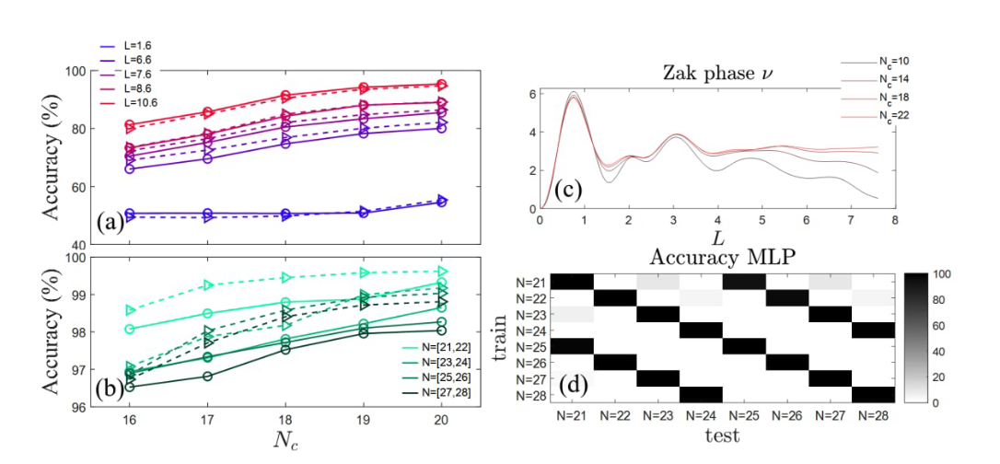

# Topology classification
The repository contains сode for ML and DL used in paper - TBA.

## Content:
* [notebooks](./notebooks) - contains scripts (jupyter notebooks) for training and testing algoritms

* [utils](./utils) - contains defenition of DL models and useful functions for data processing



## Instalation


### Linux (preferred)
1. Install [poetry](https://python-poetry.org/)

2. Install deps:

```bash
poetry install
```

### MacOS (arm)

```bash
python3 -m venv .venv
source .venv/bin/activate
pip install -r requirements_mac_arm.txt
```

## Dataset

The dataset should be in the root of the repository in the `./data` folder

## Run notebooks:

On Linux:
```bash
poetry run jupyter-notebook notebooks
```

On MacOS:
```bash
jupyter-notebook notebooks
```

